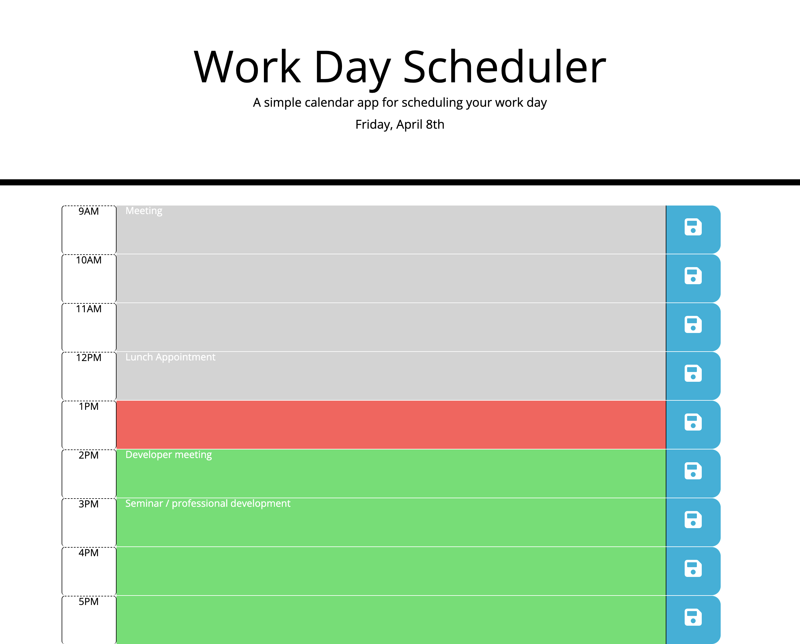

# Work Day Scheduler

---

Work Day Sheduler is a very simple appointment scheduler. You are presented with a column of hourly time slots from 9 AM to 5 PM. Grey rows indicate times that have passed, red is present time, and green rows are future time slots. Get organized!
​
## User Interface

## Usage
Click on a appointment slot to enter a meeting description. You can edit the calendar by selecting text and changing it as meany times as you want. Pressing the save button will save your calendar to local storage so it will persist between sessions.

## Links to website and Github
[Work Day Schduler website](https://bagl0025.github.io/work_day_scheduler)

[Github Repository](https://github.com/bagl0025/work_day_scheduler.git)

## Author
Brian Bagley

April 2022
